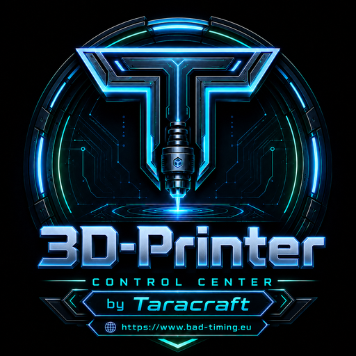
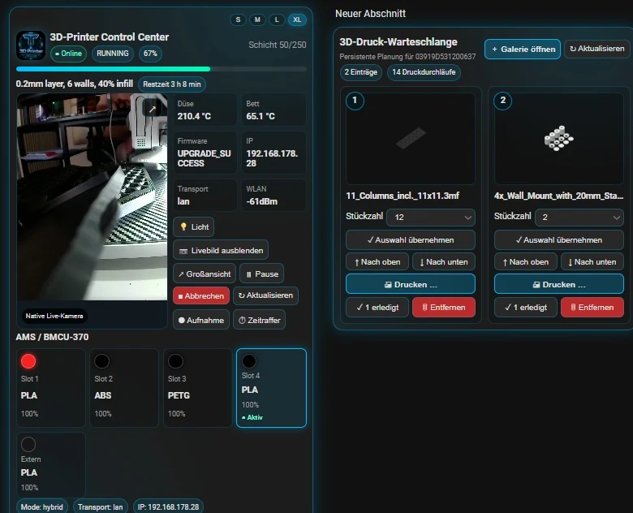
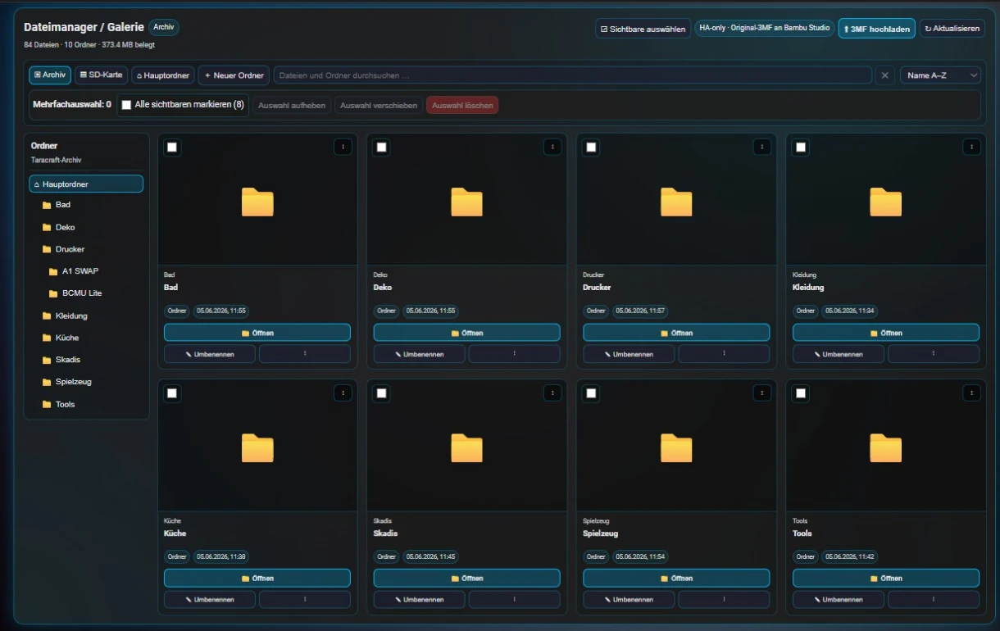
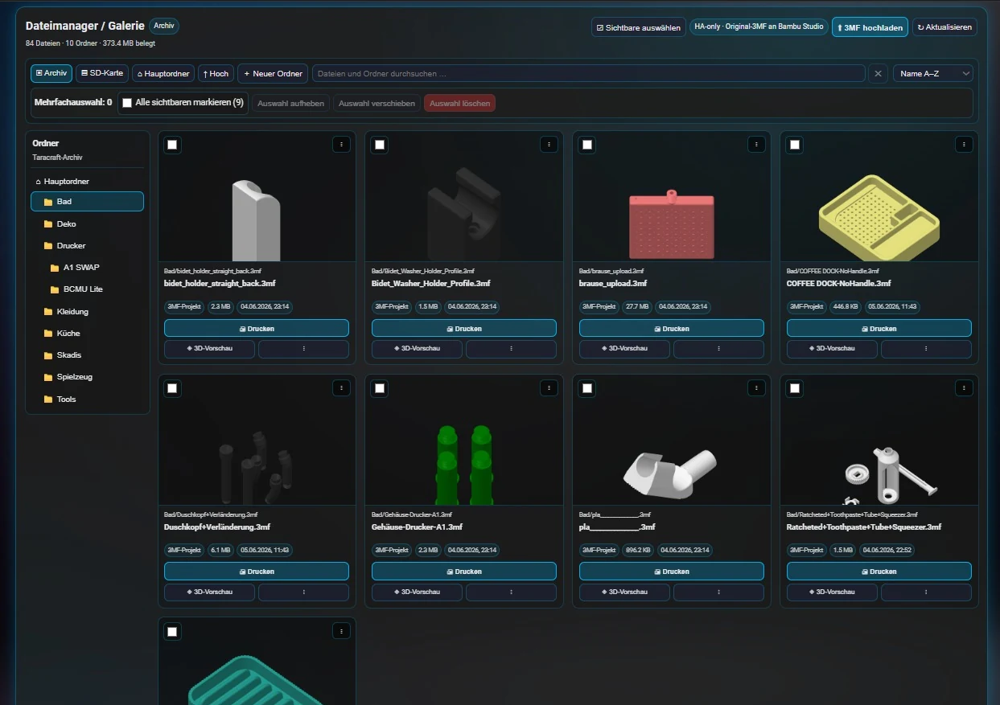
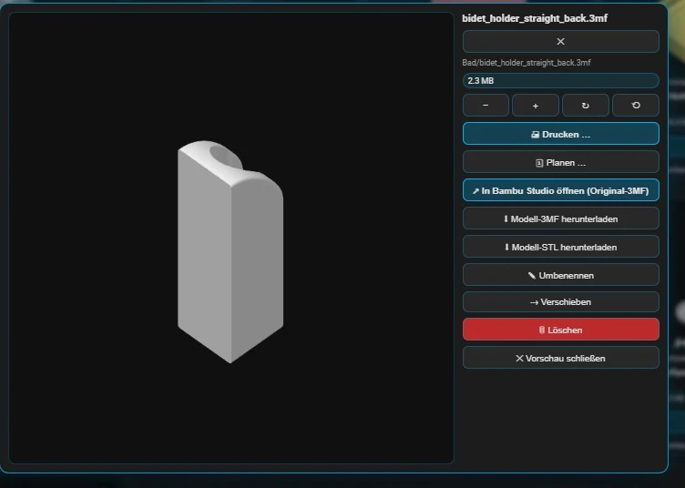
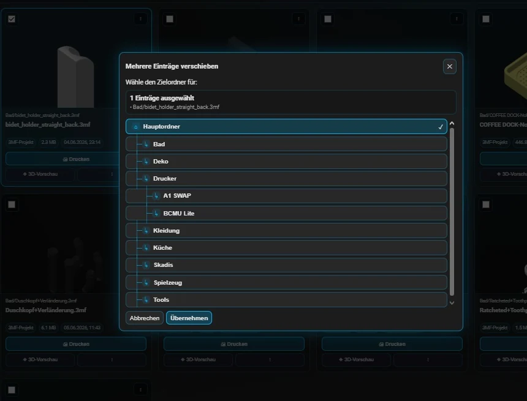
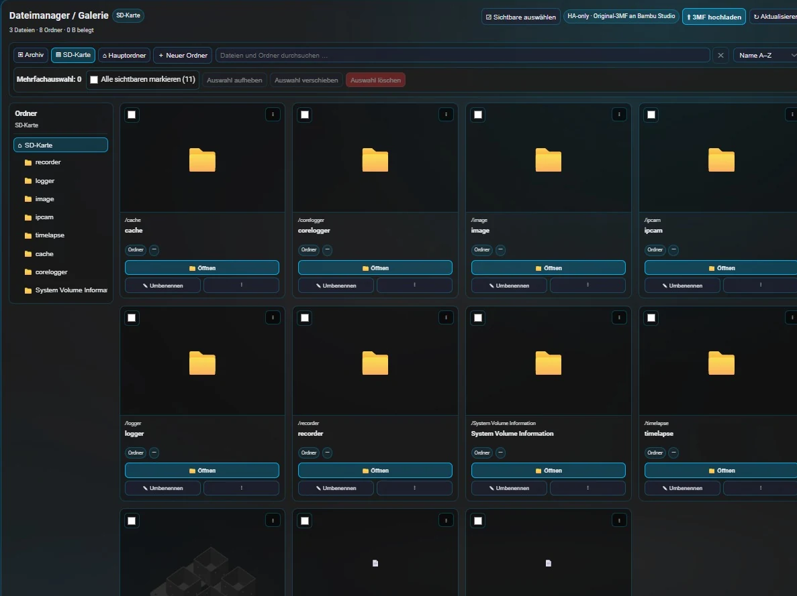

# 3D-Printer Control Center for Home Assistant

[Full changelog](CHANGELOG.md) · [Deutsches Änderungsprotokoll](CHANGELOG.de.md)

<p align="center"></p>

<p align="center">
  <strong>Local-first control center for compatible Bambu Lab 3D printers in Home Assistant.</strong><br>
  Telemetry, native camera, print queue, local 3MF archive, SD-card browser and Bambu Studio handoff in one integration.
</p>

<p align="center">
  <a href="README.de.md">Deutsch</a> ·
  <a href="CHANGELOG.md">Changelog</a> ·
  <a href="docs/SETUP.md">Setup guide</a> ·
  <a href="docs/MIGRATION.md">Migration</a> ·
  <a href="docs/PRIVACY.md">Privacy and security</a>
</p>

## Preview

<p align="center">
  
</p>

<p align="center"><em>Compact 3D print dashboard: printer card on the left, persistent queue on the right.</em></p>

<table>
  <tr>
    <td width="50%"></td>
    <td width="50%"></td>
  </tr>
  <tr>
    <td align="center"><strong>Folder-aware gallery</strong></td>
    <td align="center"><strong>3MF model grid with previews</strong></td>
  </tr>
  <tr>
    <td width="50%"></td>
    <td width="50%"></td>
  </tr>
  <tr>
    <td align="center"><strong>Large model preview</strong></td>
    <td align="center"><strong>Structured folder move dialog</strong></td>
  </tr>
</table>

<p align="center">
  
</p>

<p align="center"><em>FTPS SD-card browser where the printer firmware exposes it.</em></p>

## Highlights

- HACS-compatible repository structure
- visible product name: **3D-Printer Control Center**
- internal Home Assistant domain: `printer_control_center`
- LAN-only, Cloud-only and Hybrid setup modes
- manual printer IP with priority over optional automatic discovery
- German and English setup translations
- selectable dashboard language: `Automatic`, `Deutsch`, `English`
- native Home Assistant camera entity where the compatible camera protocol is available
- responsive Lovelace cards including **3D printer file manager/gallery** and an integrated **3D print queue**
- two automatically managed dashboards: compact **3D print** and full-width **3D printer file manager/gallery**
- local 3MF archive with ZIP export and ZIP import preserving folder structure
- SD-card access through printer FTPS where supported
- direct Bambu Studio handoff using unchanged original 3MF files
- no Windows helper, bridge service, external proxy or extra container

## Install through HACS

1. Add this repository to HACS as a custom **Integration** repository.
2. Install **3D-Printer Control Center**.
3. Restart Home Assistant.
4. Add the integration under **Settings → Devices & services**.
5. The integration creates its two standard dashboards automatically unless this is disabled during setup.

[Open the repository on GitHub](https://github.com/Taracraft/3D-Printer-Control-Center)

## Back up and restore the gallery

The local archive in **3D printer file manager/gallery** provides two buttons:

```text
Export gallery ZIP
Import gallery ZIP
```

The export contains every 3MF model and the complete folder structure. The import asks before overwriting existing files.

## Persistent data

```text
<HA config>/printer_control_center/archive/
<HA config>/printer_control_center/uploads/
<HA config>/printer_control_center/print_queue.json
```

## Planned features

- filament inventory management
- print-cost calculation
- project management with pictures, documentation and additional materials
- MakerWorld import

## Security

Never post LAN access codes, Cloud tokens or unredacted diagnostics in public issues.

## Managed dashboards

The integration creates two Lovelace dashboards by default:

- **3D print** with a compact printer card on the left and the queue on the right
- **3D printer file manager/gallery** as a full-width view

This can be disabled in the setup assistant and changed later in the integration options. The `printer_control_center.install_dashboards` service recreates or repairs the integration dashboards.

Gallery ZIP imports and normal 3MF uploads continue as a compact expandable browser background task while switching dashboards. The task shows progress, transfer speed, extraction status and verification. After a full browser reload, an existing upload fragment can be resumed by selecting the same local file again. Stale fragments are cleaned automatically.
